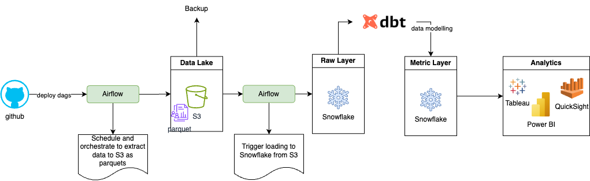
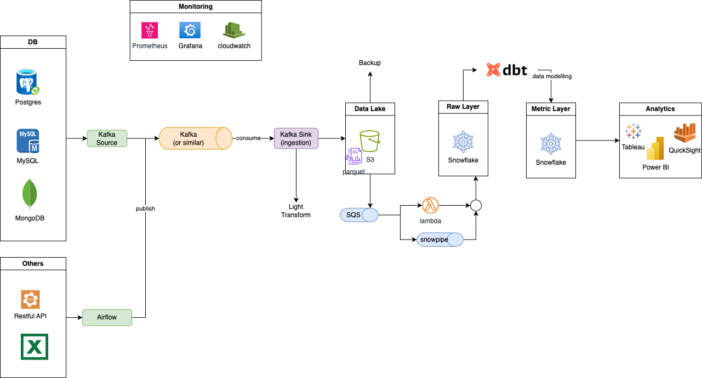

# Task 1: Design a data pipeline for customer segments
- Here we use python, and dbt as main tool
- Docker to be easy to run and demo
- Data would be in `dbt/data/thelook_ecommerce.db` (Sqlite)
- Models for the data mart, created in `dbt/models/metric/metric__customer_segments.sql`. Here we get data for last 2 years, because last year does not have data.

## How to run the code
1. Clone the repo
    ```
        git clone https://github.com/duylamvo/i-conrad.git
    ```

1. Build docker file
    ```bash
        docker buid -t conrad .
    ```

1. Check and see guidlides
    ```bash
        docker run -it conrad --help
    ```

    ```text
        NAME
            main.py - Contains all commans to be run as CLI or docker run.

        SYNOPSIS
            main.py COMMAND

        DESCRIPTION
            Contains all commans to be run as CLI or docker run.

        COMMANDS
            COMMAND is one of the following:

            build_models
            dbt run to build models.

            clean
            Clean.

            ingest_gdrive
    ```
    press `esc` and `:q` exit.

1. Download zipfile from google drive, extract them to a folder, and ingest to database (Sqlite) 
    ```bash
        
        docker run \
            -it \
            -v ./dbt/data:/app/dbt/data \
            -v ./data:/app/data \
            conrad ingest-gdrive \
                --gdrive_link='https://drive.google.com/file/d/1vcb_HBWsOSKW4XxhLfRpGlLzBLwHlGWJ/view?ts=642d8042' \
                --db-file='dbt/data/thelook_ecommerce.db' \
                --if-exists='replace'

    ```
    ```text
        Downloading...
        From (original): https://drive.google.com/uc?id=1vcb_HBWsOSKW4XxhLfRpGlLzBLwHlGWJ
        From (redirected): ...
        To: /app/thelook_ecommerce.zip
        100%|████████████████████████████████████████████████████████████████████████████████████████████████████████████████████████████████████████████████████████████████████████████████████████████████████████████████████████████████████████████████| 154M/154M [00:11<00:00, 12.9MB/s]
        File downloaded at thelook_ecommerce.zip
        All files extracted to data
        Loaded products.csv into table products
        Loaded orders.csv into table orders
        Loaded inventory_items.csv into table inventory_items
        Loaded users.csv into table users
        Loaded distribution_centers.csv into table distribution_centers
    ```
    ### Arguments:
    - `db-file` (Optional) is the path, use it to mount the data file in case you want to check data outside of container
    - More information, then run `docker run -it ingest-gdrive --help`


1. Build DBT models (data modeling)
    ```
        docker run -it \
            -v ./dbt/data:/app/dbt/data \
            conrad \
                build-models
    ```
    ```text
        Found 6 models, 0 tests, 0 snapshots, 0 analyses, 440 macros, 0 operations, 0 seed files, 0 sources, 0 exposures, 0 metrics, 0 groups

        1 of 3 START sql table model main.stg__customer_nearest_centers ................ [RUN]
        1 of 3 OK created sql table model main.stg__customer_nearest_centers ........... [OK in 4.44s]
        2 of 3 START sql table model main.stg__customer_profit ......................... [RUN]
        2 of 3 OK created sql table model main.stg__customer_profit .................... [OK in 0.43s]
        3 of 3 START sql table model main.metric__customer_segments .................... [RUN]
        3 of 3 OK created sql table model main.metric__customer_segments ............... [OK in 0.57s]
        
        Finished running 3 table models in 0 hours 0 minutes and 5.53 seconds (5.53s).
        ...
    ```
1. Show the analyze of data
    ```
        docker run -it \
            -v ./dbt/data:/app/dbt/data \
            conrad analyze --model customer_segments

    ```
    ```
        Found 3 models, 0 tests, 0 snapshots, 0 analyses, 308 macros, 0 operations, 0 seed files, 7 sources, 0 exposures, 0 metrics, 0 groups
         
        Concurrency: 1 threads (target='dev')
         
        Previewing node 'metric__customer_segments':

        | user_id | nearest_center_id | distance_km | return_rate | total_sales | total_spending | ... |
        | ------- | ----------------- | ----------- | ----------- | ----------- | -------------- | --- |
        |       5 |                 3 |    367.847… |           0 |           3 |       233.570… | ... |
        |       7 |                 9 |  6,645.155… |           0 |           8 |       395.100… | ... |
        |       8 |                 9 |  5,433.229… |           0 |           1 |       120.000… | ... |
        |      10 |                 4 | 11,683.982… |           0 |           1 |       130.990… | ... |
        |      14 |                 9 |  6,386.956… |           0 |           1 |        87.570… | ... |
    ```
    - Notice the scripts for data modeling include
        - `dbt/models/stg/stg__customer_nearest_centers.sql`: to calculate nearest centers closed to customers
        - `dbt/models/stg/stg__customer_profit.sql`: to calculate the profit in previous 2 years
        - `dbt/models/metric/metric__customer_segments.sql` to create final data mart for customer segments.
        - `dbt/data/thelook_ecommerce.db` (database file)

    You can actually can query from table : `metric__customer_segments` at the end by running this script:

    ```python
    import sqlite3
    import pandas as pd

    conn = sqlite3.connect("dbt/data/thelook_ecommerce.db")
    
    # Get table list
    tables = pd.read_sql("SELECT name FROM sqlite_master WHERE type='table'", conn)
    tables = tables.name.to_list()

    # Load table for demo
    table = "metric__customer_segments"
    assert table in tables

    df = pd.read_sql(f"SELECT * FROM {table}", conn)
    df.head(10)
    ```
    ```text
        user_id  nearest_center_id   distance_km  return_rate  total_sales  total_spending profit_level
    0        5                  3    367.847323          0.0            3      233.570000      Level 3
    1        7                  9   6645.154603          0.0            8      395.100000      Level 3
    2        8                  9   5433.229395          0.0            1      120.000000      Level 2
    3       10                  4  11683.981651          0.0            1      130.990005      Level 2
    4       14                  9   6386.955969          0.0            1       87.570000      Level 2
    5       16                  6   6222.902517          0.0            2      307.860001      Level 3
    6       19                 10    427.745066          0.0            1      105.000000      Level 2
    7       20                 10   7223.883618          0.0            1       79.900002      Level 2
    8       22                  2    337.452462          1.0            1       18.990000      Level 1
    9       24                  4  11431.773566          0.0            1       16.950001      Level 1
    ```

1. You can clean all data by:
    ```
        docker run \
            -it \
            -v ./dbt/data:/app/dbt/data \
            -v ./data:/app/data \
            conrad clean
    ```
    ```text
        Deleted dbt/data/thelook_ecommerce.db
        Deleted data/products.csv
        Deleted data/orders.csv
        Deleted data/inventory_items.csv
        Deleted data/users.csv
        Deleted data/distribution_centers.csv
        Deleted data/readme.txt
        Deleted data/events.csv
        Deleted data/order_items.csv
    ```

# Task 2: What additional features would you recommend? Why?
1. Recency:
    - metric: Number of days since the last purchase.
    - why: How recently a customer made a purchase.
1. Frequency:
    - metric: Number of orders placed in the last year.
    - why: How often a customer makes a purchase.
1. Monetary Value:
    - metric: Total amount spent by a customer in the last year.
    - why: How much money a customer spends.
1. Customer Lifetime Value (CLV):
    - metric: Predicted total value a customer brings over their entire relationship with the business.
    - why: Average order value multiplied by the purchase frequency and customer lifespan.

# Task 3: Draw an architecture diagram/block diagram in operationalising the preprocessing flow + model to run weekly. 
## Simple version



- Used Airflow (or similar tool) to load to data lake
- Airflow is a main scheduler and orchestrator tool
- Data Modelling is done via dbt core or dbt cloud. For dbt core we can schedule it via Airflow as well

## Enhanced version with Streaming and Scaling

   

1. Benefits

    - This could create generic and standard to land data to Data Lake
    - Generic and standard can be scaled and automated
    - Can convert Metric Layer to data mesh, and shift to data as a service

1. Challenges

    - Require much effort to implementation Kafka, Monitoring
    - Could increase the cost of storage and processing
    - Manage and orchestration could be decentralized to dags, dbt, and monitoring for kafka. But at moment we do not have a tool can do everything.
    - Reqire more technical skills